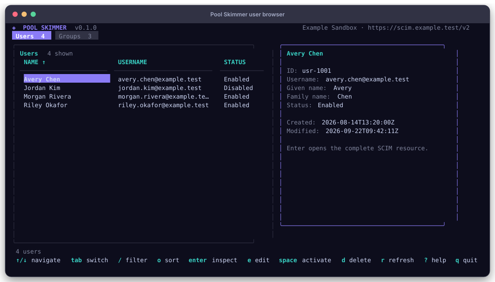
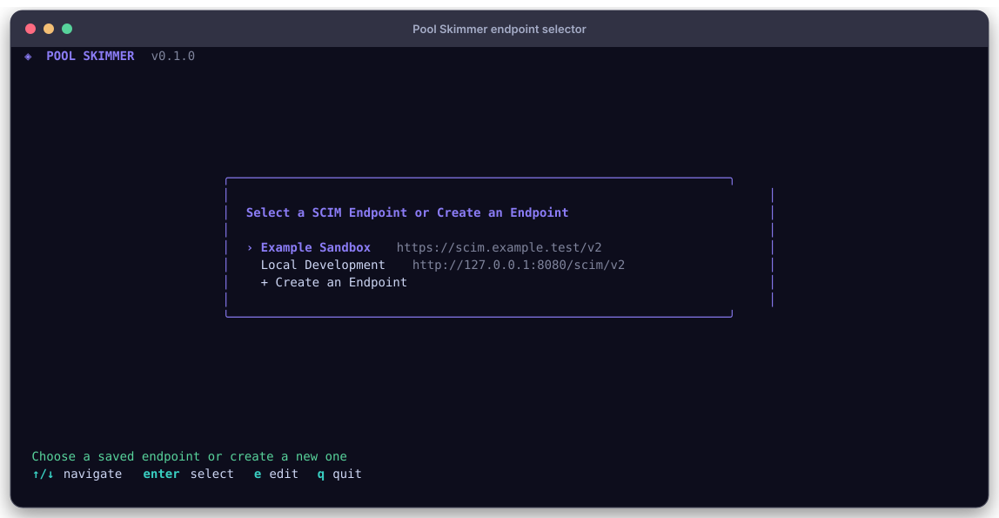
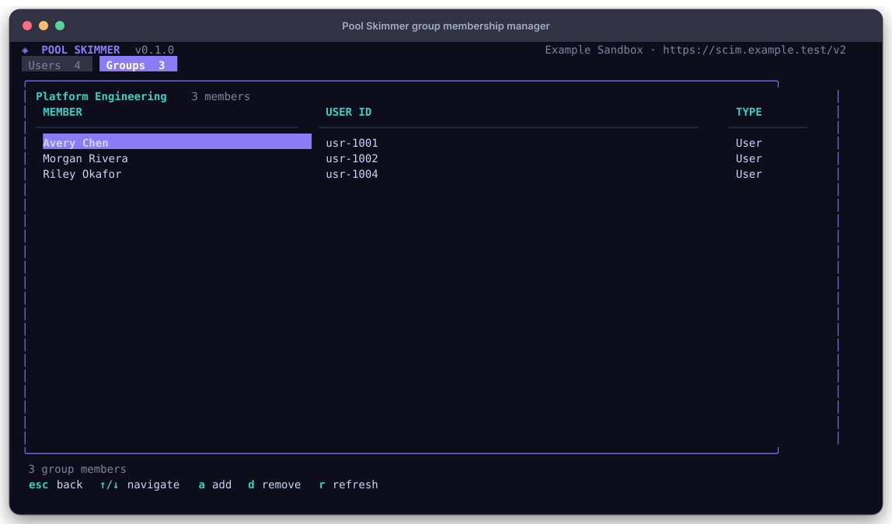

# Pool Skimmer

Pool Skimmer is a provider-neutral SCIM 2.0 client for inspecting and managing
users and groups. It combines an interactive terminal UI with a command-based
interface designed for scripts and automation.



> [!IMPORTANT]
> Pool Skimmer is pre-release software. The canonical GitHub owner, module path,
> license, and first successful CI and release runs must be finalized before
> `v0.1.0`. Until then, build and evaluate it from this source tree.

## What it does

- Lists, filters, sorts, and inspects SCIM users and groups.
- Creates, patches, replaces, and deletes resources.
- Activates and deactivates users.
- Renames groups and manages group membership.
- Preserves provider-specific attributes when reading and writing resources.
- Supports human-readable tables plus JSON and JSONL output for automation.
- Exports complete user or group collections to permission-restricted JSON files.
- Provides dry runs, conditional writes with `If-Match`, guarded deletion, and
  read-back verification for convenience mutations.
- Stores named endpoint settings separately from API-key files.

Pool Skimmer changes resources through the configured SCIM service root. It does
not administer provider directories, configure Okta Push Groups, or manage an
application's private group-linking workflow.

## Supported platforms

| Platform | amd64 | arm64 |
| --- | :---: | :---: |
| Linux | Yes | Yes |
| macOS | Yes | Yes |
| Windows | Not currently packaged | Not currently packaged |

The runtime container is Linux-based and runs as an unprivileged user. SCIM
provider behavior varies: filters, PATCH support, schemas, discovery metadata,
and required authorization scopes are not uniform across implementations.

## Build from source

The reproducible build uses Docker; a host Go toolchain is not required.

```sh
make test
make image VERSION=0.1.0
make dist VERSION=0.1.0
```

`make dist` writes binaries for all four supported platform and architecture
combinations under `dist/`:

```text
dist/darwin-amd64/pool-skimmer
dist/darwin-arm64/pool-skimmer
dist/linux-amd64/pool-skimmer
dist/linux-arm64/pool-skimmer
```

Run the binary that matches your system:

```sh
./dist/darwin-arm64/pool-skimmer version
./dist/darwin-arm64/pool-skimmer
```

Pushing a `vMAJOR.MINOR.PATCH` tag runs the included release workflow, which
builds all four targets, publishes `.tar.gz` archives and `SHA256SUMS`, and
attests the artifacts before creating a GitHub Release. A multi-architecture
GHCR image is still planned. The remaining launch gates are tracked in
[public-repository-plan.md](public-repository-plan.md).

## Connect to a SCIM endpoint

Run `pool-skimmer` without arguments from an interactive terminal. The first
screen lets you select a saved endpoint or create one.



Named profiles are stored under `~/.pool-skimmer/`:

- `config.json` contains endpoint names, URLs, authentication settings,
  timeouts, and safe-read retry settings.
- `credentials/` contains a separate API-key file for each profile.

Pool Skimmer creates directories with mode `0700` and files with mode `0600`.
It never writes API keys to `config.json`. Saved keys are still local plaintext
protected by filesystem permissions; use the secure prompt when a key should
not be persisted.

```sh
pool-skimmer \
  --endpoint 'https://scim.example.test/v2' \
  --prompt-api-key \
  doctor
```

For automation, prefer a protected key file:

```sh
SCIM_ENDPOINT='https://scim.example.test/v2' \
SCIM_API_KEY_FILE='/secure/path/pool-skimmer.key' \
pool-skimmer users list --all --output json
```

Named profiles work with non-interactive commands too:

```sh
pool-skimmer --profile 'Example Sandbox' doctor
pool-skimmer --profile 'Example Sandbox' groups list --all
```

Connection settings resolve in this order:

1. Explicit flags such as `--endpoint` and `--api-key-file`.
2. `SCIM_*` environment variables.
3. The selected named profile.
4. Built-in defaults.

A profile key is never reused when `--endpoint` overrides that profile's URL.
Most providers use `Authorization: Bearer <key>`; customize this with
`SCIM_AUTH_HEADER`, `SCIM_AUTH_SCHEME`, or the corresponding flags. An explicitly
empty scheme sends the key without a prefix.

Always use HTTPS for remote endpoints. The current pre-release build still
accepts plain HTTP; reserve it for loopback development while HTTPS enforcement
remains a public-release blocker.

## Interactive terminal UI

The TUI loads users and groups concurrently and keeps network work off the
rendering path. It supports:

- local text and structured filtering;
- typed sorting by visible columns;
- complete resource inspection and JSON copy;
- edits to common user and group fields;
- user activation and deactivation;
- group membership management;
- explicit confirmation before deletion;
- refresh while retaining the last successfully loaded collection on failure;
- responsive layouts and an in-app `?` keyboard reference.



Press `/` in the resource browser to filter the loaded collection. Plain text
searches common names, usernames, and IDs. Structured clauses are combined with
AND:

```text
enabled=true
status=disabled
username~@example.test enabled=true
name="Avery Chen"
members>0
```

Text fields support `=`, `!=`, and case-insensitive `~`. Group member counts
also support `>`, `>=`, `<`, and `<=`. These are local filters; they do not
send provider-specific SCIM filter expressions.

Press `o` to choose a visible sort column and direction. Users and groups retain
independent filter and sort settings. Press `c` from resource details to copy
the complete JSON resource without terminal borders or styling.

Press `x` from the resource browser to export the currently shown users or
groups as a JSON array. The TUI prompts for a path, creates the file with mode
`0600`, and does not overwrite an existing file.

Press `r` from the resource browser or detail view to refresh both users and
groups. In the group-members view, `r` refreshes only that group's membership.

## Command-line examples

Every explicit subcommand works non-interactively.

```sh
# Read
pool-skimmer users list --filter 'active eq true'
pool-skimmer users list --all --output json
pool-skimmer users list --all --output jsonl
pool-skimmer users export users.json
pool-skimmer groups export groups.json
pool-skimmer users get USER_ID
pool-skimmer groups get GROUP_ID

# Create from a file or inline JSON
pool-skimmer users create --data @user.json
pool-skimmer groups create --data '{"displayName":"Platform"}'

# Targeted PATCH operations
pool-skimmer users patch USER_ID --replace active=false
pool-skimmer groups patch GROUP_ID --replace 'displayName="IT"'
pool-skimmer groups patch GROUP_ID --add 'members=[{"value":"USER_ID"}]'
pool-skimmer groups patch GROUP_ID --remove 'members[value eq "USER_ID"]'

# Convenience commands with read-back verification
pool-skimmer users activate USER_ID
pool-skimmer users deactivate USER_ID
pool-skimmer groups rename GROUP_ID 'IT'
pool-skimmer groups members list GROUP_ID
pool-skimmer groups members add GROUP_ID USER_ID
pool-skimmer groups members remove GROUP_ID USER_ID

# Full replacement and guarded deletion
pool-skimmer groups replace GROUP_ID --data @group.json --if-match 'W/"etag"'
pool-skimmer users delete USER_ID --yes
```

JSON input may be inline, loaded from `@FILE`, or read from standard input with
`-`. PATCH helpers accept repeatable `--add`, `--replace`, and `--remove`
operations. A `PATH=VALUE` value is decoded as JSON when valid and otherwise
treated as a string.

Use `--dry-run` with every mutation to print the intended method, path, and
payload without requiring credentials or contacting the endpoint:

```sh
pool-skimmer groups rename GROUP_ID 'IT' --dry-run
```

Run `pool-skimmer --help`, `pool-skimmer groups --help`, or a specific command's
`--help` output for the complete flag reference. Shell-completion scripts are
available through `pool-skimmer completion`.

Export commands retrieve every remaining page and write a JSON array. Export
files are created with mode `0600` because directory data may be sensitive.
Existing files are preserved unless `--force` is passed. Exports support the
same `--filter`, `--start-index`, `--count`, `--attributes`, and
`--excluded-attributes` controls as list requests.

## Run the local image

Build the runtime image, then pass connection settings at runtime:

```sh
make image VERSION=0.1.0

docker run --rm pool-skimmer:local version

docker run --rm -it \
  -e SCIM_ENDPOINT='https://scim.example.test/v2' \
  pool-skimmer:local --prompt-api-key
```

The image is based on `scratch`, contains only the statically linked executable
and CA certificates, and runs as UID/GID `65532`. The included Compose service
uses a read-only filesystem, drops all Linux capabilities, and enables
`no-new-privileges`.

To use saved profiles in the read-only container, mount a configuration
directory writable by UID/GID `65532` and select it with `--config-dir`.

## Safety model

- GET requests may retry transient transport failures, HTTP 429 responses, and
  eligible server failures. POST, PATCH, PUT, and DELETE are never retried
  automatically.
- Deletion requires interactive confirmation. Non-interactive callers must pass
  `--yes`.
- PATCH, PUT, DELETE, and convenience mutations accept `--if-match` for
  provider-supported optimistic concurrency.
- Convenience mutations read the resource back after a successful write. Use
  `--no-verify` only for an incompatible provider.
- Response reads are bounded, resource IDs are URL-escaped, authentication
  headers are validated, and authorization values are redacted from errors.
- Machine-readable stdout is reserved for command results; diagnostics go to
  stderr.

Before changing production data, confirm the provider's supported schemas,
filters, PATCH behavior, concurrency semantics, and authorization scopes.

## Development

Application code is written in Go. Command construction and terminal concerns
live in `internal/cli`, the interactive application in `internal/tui`, and the
SCIM protocol client in `internal/scim`.

Use the Docker-backed targets for repository validation:

```sh
make test                    # go test ./... and go vet ./...
make image VERSION=0.1.0     # runnable Linux image
make dist VERSION=0.1.0      # Linux and macOS, amd64 and arm64
```

Do not include real endpoints, API keys, directory exports, or captures with
real user or group data in issues, tests, documentation, or screenshots.
